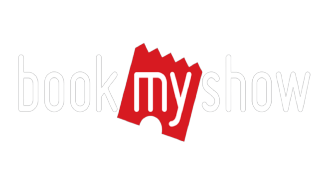

# 🎬 Book My Show Clone - Movie Ticket Booking Platform

<div align="center">
  
  <p><strong>A modern movie ticket booking platform with CI/CD implementation</strong></p>
</div>

## 🌟 Features

- 🎫 Real-time movie ticket booking system
- 🍿 Food & beverages ordering
- 🎯 Interactive seat selection
- 👥 User authentication & profile management
- 💳 Secure payment integration
- 📱 Responsive design for all devices
- 📖 Booking history tracking
- 🎥 Detailed movie information and ratings

## 🛠️ Technology Stack

### Frontend
- **Framework:** React.js (v17)
- **State Management:** Redux with Thunk
- **Routing:** React Router v5
- **UI Components:** Material-UI, Ant Design
- **Styling:** CSS Modules, Styled Components
- **Carousel:** React Multi Carousel, React Elastic Carousel

### DevOps & Deployment
- **CI/CD:** Jenkins Pipeline
- **Containerization:** Docker
- **Container Orchestration:** Kubernetes (EKS)
- **Code Quality:** SonarQube
- **Security Scanning:** 
  - OWASP Dependency Check
  - Trivy File System Scan
- **Cloud Platform:** AWS EKS

## 🚀 Getting Started

### Prerequisites
- Node.js (v18 or higher)
- Docker
- npm or yarn

### Local Development Setup

1. **Clone the repository**
```bash
git clone https://github.com/harsht1608/Book-My-Show.git
cd Book-My-Show/bookmyshow-app

# Install dependencies
npm install

# Start development server
npm start

# 🐳 Docker Deployment
# Build the image
docker build -t hash/bms:latest .

# Run container
docker run -d -p 3500:3500 hash/bms:latest

# ☸️ Kubernetes Deployment
# Apply Kubernetes manifests
kubectl apply -f deployment.yml
kubectl apply -f service.yml

🔄 CI/CD Pipeline
Our project implements a robust CI/CD pipeline using Jenkins with the following stages:

Workspace Cleanup
Source Code Checkout
SonarQube Analysis
Quality Gate Check
Dependency Installation
Security Scanning
OWASP Dependency Check
Trivy FS Scan
Docker Build & Push
Deployment
Docker Container (Development)
AWS EKS (Production)

📸 Application Screenshots
Home Page

Movie Details


# # 🚀 **DevOps Project: Book My Show App Deployment**  

# Welcome to the **Book My Show App Deployment** project! This project demonstrates how to deploy a **Book My Show-clone application** using modern DevOps tools and practices, following a **DevSecOps** approach.  

# ---

# ## 🛠️ **Tools & Services Used**

# | **Category**       | **Tools**                                                                                                                                                                                                 |
# |---------------------|-----------------------------------------------------------------------------------------------------------------------------------------------------------------------------------------------------------|
# | **Version Control** |                                                                                                        |
# | **CI/CD**           |                                                                                                     |
# | **Code Quality**    |                                                                                               |
# | **Containerization**|                                                                                                        |
# | **Orchestration**   |                                                                                           |
# | **Monitoring**      |   |
# | **Security**        |           |

# ---

# ## 🚦 **Project Stages**

# ### **Phase 1: Deployment to Docker Container**
# - Containerize the application using Docker.
# - Build and push Docker images to a container registry.
# - Run the application in a Docker container.

# ### **Phase 2: Deployment to EKS Cluster with Monitoring**
# - Deploy the application to an **Amazon EKS (Elastic Kubernetes Service)** cluster.
# - Set up **Prometheus** and **Grafana** for monitoring and visualization.
# - Implement **Trivy** for vulnerability scanning and **OWASP** for security best practices.

# ---

# ## 📂 **Code Repository**
# Explore the code and contribute to the project:  
# [](https://github.com/KastroVKiran/Book-My-Show.git)

# ---

# ## 📹 **Project Video**
# Watch the step-by-step deployment process:  
# [](https://youtu.be/hBGVwa8MY4A)

# ---

# ## 📺 **Docker Playlist**
# Learn more about Docker with this playlist:  
# [](https://www.youtube.com/playlist?list=PLs-PsDpuAuTeNx3OgGQ1QrpNBo-XE6VBh)

# ---

# ## 🚀 **Other DevOps Projects**

# | **Project**                                | **Video Link**                                                                                   |
# |--------------------------------------------|--------------------------------------------------------------------------------------------------|
# | **SWIGGY App Project**                     | [](https://youtu.be/x55z7rk0NAU) |
# | **Zomato App Project**                     | [](https://youtu.be/GyoI6-I68aQ) |
# | **Jenkins + Terraform + EKS Integration**  | [](https://youtu.be/DV79JyFbQE8) |
# | **AWS 3 Tier Architecture Project**        | [](https://youtu.be/Oj-Hr_aulKA) |

# ---

# ## 🤝 **Connect with Me**

# Let's connect and discuss DevOps!  

# [](https://www.linkedin.com/in/kastro-kiran/)  
# [](https://chat.whatsapp.com/EGw6ZlwUHZc82cA0vXFnwm)

# ---

# ## 📣 **Feedback Request**

# After deploying the app, share your feedback on LinkedIn! Tag me and include the project link to help spread the word.  

# ---

# ## 🎉 **Happy Learning!**  

# **KASTRO KIRAN V**
